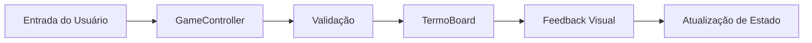

<div align="center">

# 🌌 NEON TERMO

### Jogo de Palavras Futurista em Português 🇧🇷

[](https://developer.mozilla.org/en-US/docs/Web/HTML)
[](https://developer.mozilla.org/en-US/docs/Web/CSS)
[](https://developer.mozilla.org/en-US/docs/Web/JavaScript)
[](https://www.python.org/)

**Um clone moderno e estilizado do Wordle/Termo com estética cyberpunk neon, múltiplos modos de jogo e temas visuais dinâmicos.**

[🎮 Jogar Agora](#-como-jogar) • [✨ Funcionalidades](#-funcionalidades) • [🛠️ Tecnologias](#️-tecnologias) • [📦 Instalação](#-instalação)


</div>

---

## 📖 Sobre o Projeto

**Neon Termo** é um jogo de adivinhação de palavras inspirado no Wordle, desenvolvido do zero com **HTML, CSS e JavaScript puro**. O projeto combina uma interface futurista com mecânicas de jogo envolventes, oferecendo três modos de dificuldade e um sistema completo de temas visuais.

### 🎯 Objetivo

Adivinhe a palavra secreta de 5 letras em até 6 tentativas (ou mais, dependendo do modo). Após cada tentativa, as letras mudam de cor para indicar o quão perto você está da solução!

---

## ✨ Funcionalidades

### 🎮 Três Modos de Jogo

| Modo | Palavras | Tentativas | Dificuldade |
|------|----------|------------|-------------|
| **TERMO** | 1 | 6 | ⭐ Fácil |
| **DUETTO** | 2 | 7 | ⭐⭐ Médio |
| **QUARTETO** | 4 | 9 | ⭐⭐⭐ Difícil |

### 🎨 Sistema de Temas

<table>
  <tr>
    <td align="center">
      <br/>
      <b>🌌 Neon</b><br/>
      <sub>Cyberpunk Futurista</sub>
    </td>
    <td align="center">
      <br/>
      <b>🌿 Nature</b><br/>
      <sub>Paleta Natural</sub>
    </td>
    <td align="center">
      <br/>
      <b>🌅 Retro</b><br/>
      <sub>Anos 80 Sunset</sub>
    </td>
  </tr>
</table>

### 🚀 Recursos Avançados

- ✅ **Normalização Automática de Acentos** - Digite sem acentos, o jogo completa!
- ⌨️ **Teclado Virtual Interativo** - Feedback visual em tempo real
- ↔️ **Navegação com Setas** - Mova o cursor entre células
- 🎯 **Validação Inteligente** - 6000+ palavras do dicionário português
- 📊 **Sistema de Estatísticas** - Rastreie vitórias, sequências e percentuais
- 💾 **Persistência Local** - Progresso salvo automaticamente
- 📱 **Design Responsivo** - Funciona perfeitamente em qualquer dispositivo
- 🎭 **Animações Suaves** - Transições e efeitos de brilho neon

---

## 🎮 Como Jogar

### Mecânica Básica

1. Digite uma palavra de 5 letras usando o teclado (físico ou virtual)
2. Pressione **ENTER** para submeter
3. Observe as cores das letras:
   - 🟩 **Verde** = Letra correta na posição certa
   - 🟨 **Amarelo** = Letra existe, mas na posição errada
   - ⬛ **Cinza** = Letra não existe na palavra
4. Continue tentando até acertar ou esgotar as tentativas!

### Controles

#### ⌨️ Teclado Físico
- `A-Z` - Digitar letras
- `Enter` - Submeter palavra
- `Backspace` - Apagar letra
- `← / →` - Navegar entre células
- `Esc` - Fechar modais

#### 🖱️ Interface
- Clique nas teclas virtuais para digitar
- `?` - Abrir ajuda
- `📊` - Ver estatísticas
- `🎨` - Trocar tema
- `NOVA PALAVRA` - Reiniciar jogo

---

## 🛠️ Tecnologias

### Frontend
- **HTML5** - Estrutura semântica
- **CSS3** - Variáveis CSS, Grid, Flexbox, Animações
- **JavaScript ES6+** - Classes, Arrow Functions, LocalStorage API

### Backend/Processamento
- **Python 3** - Script de processamento de palavras

### Tipografia
- **Google Fonts** - [Orbitron](https://fonts.google.com/specimen/Orbitron) (Futurista)

---

## 📦 Instalação

### Opção 1: Download Direto

```bash
# Clone o repositório
git clone https://github.com/seu-usuario/neon-termo.git

# Entre na pasta
cd neon-termo

# Abra o index.html no navegador
start index.html  # Windows
open index.html   # macOS
xdg-open index.html  # Linux
```

### Opção 2: Servidor Local

```bash
# Usando Python
python -m http.server 8000

# Usando Node.js
npx http-server

# Acesse http://localhost:8000
```

### Requisitos
- ✅ Navegador moderno (Chrome, Firefox, Safari, Edge)
- ✅ JavaScript habilitado
- ❌ Não requer Node.js ou dependências externas

---

## 📁 Estrutura do Projeto

```
neon-termo/
├── 📄 index.html          # Estrutura HTML principal
├── 🎨 style.css           # Estilos e temas visuais
├── ⚙️ script.js           # Lógica do jogo
├── 📚 words.js            # Base de 6000+ palavras
├── 🐍 filter_words.py     # Processador de dicionários
├── 📖 br-utf8.txt         # Dicionário fonte (2.9MB)
├── 📊 palavras.csv        # Palavras processadas
└── 📝 README.md           # Este arquivo
```

---

## 🧠 Arquitetura

### Classes Principais

#### `TermoBoard`
Gerencia um tabuleiro individual:
- Palavra secreta
- Validação de tentativas
- Renderização de células
- Cálculo de feedback (correto/presente/ausente)

#### `GameController`
Controlador central:
- Gerencia múltiplos tabuleiros
- Processa entrada do usuário
- Coordena validação de palavras
- Atualiza estatísticas e temas

### Fluxo de Dados



---

## 🎨 Paleta de Cores

### Tema Neon (Padrão)

```css
--color-bg-dark: #0a0a12;
--color-primary: #b026ff;    /* Roxo Neon */
--color-correct: #39ff14;    /* Verde Neon */
--color-present: #fff01f;    /* Amarelo Neon */
--color-accent: #00f3ff;     /* Azul Ciano */
```

### Tema Nature

```css
--color-primary: #2e7d32;    /* Verde Floresta */
--color-correct: #689f38;    /* Verde Folha */
--color-present: #fbc02d;    /* Amarelo Sol */
--color-accent: #5d4037;     /* Marrom Terra */
```

### Tema Retro

```css
--color-primary: #ff00ff;    /* Rosa Neon */
--color-correct: #00ff00;    /* Verde Matrix */
--color-present: #ffaa00;    /* Laranja Sunset */
--color-accent: #00ccff;     /* Ciano */
```

---

## 🐍 Script Python: `filter_words.py`

### Funcionalidade
Processa dicionários em português para extrair palavras válidas de 5 letras.

### Uso

```bash
# Sintaxe básica
python filter_words.py <arquivo_entrada> <arquivo_saida>

# Exemplo
python filter_words.py br-utf8.txt palavras_filtradas.txt

# Modo interativo
python filter_words.py
```

### Características
- ✅ Suporte UTF-8 (acentos preservados)
- ✅ Regex otimizado: `[^\W\d_]+`
- ✅ Filtra exatamente 5 letras
- ✅ Converte para maiúsculas
- ✅ Formato JavaScript pronto

---

## 📊 Sistema de Estatísticas

Rastreamento independente por modo:

- **Jogos Totais** - Contador de partidas
- **% Vitórias** - Taxa de sucesso
- **Sequência Atual** - Vitórias consecutivas
- **Melhor Sequência** - Recorde pessoal

Dados salvos em `localStorage` com chave `termostats`.

---

## 🌟 Diferenciais

| Característica | Descrição |
|----------------|-----------|
| 🎨 **Design Premium** | Estética neon futurista com atenção aos detalhes |
| 🎯 **Múltiplos Modos** | 3 níveis de dificuldade únicos |
| 🌈 **Temas Dinâmicos** | 3 temas completos com transições suaves |
| 🇧🇷 **PT-BR Nativo** | 6000+ palavras validadas |
| ♿ **Acessível** | Suporte completo a teclado |
| 📊 **Gamificação** | Sistema de conquistas e sequências |
| 💾 **Offline-First** | Funciona sem internet |
| 📱 **Mobile-Ready** | Responsivo em todos os dispositivos |
| 🚀 **Zero Dependencies** | Sem frameworks, carregamento instantâneo |
| 🧹 **Código Limpo** | Arquitetura OOP bem estruturada |

---

## 📱 Responsividade

### Breakpoints

- **Desktop** (>768px) - Layout completo, 4 grids lado a lado
- **Tablet** (≤768px) - Quarteto em grid 2x2
- **Mobile** (≤480px) - Células reduzidas, teclado compacto

---

## 🔧 Funcionalidades Técnicas

### Normalização de Acentos

```javascript
const normalize = (str) => str.normalize("NFD").replace(/[\u0300-\u036f]/g, "");
```

Permite digitar "MUSICA" e reconhecer como "MÚSICA".

### Sistema de Cursor Inteligente

- Navegação com setas ← →
- Backspace deleta ou retrocede
- Células ativas destacadas

### Priorização de Status

```javascript
const priority = { 'correct': 3, 'present': 2, 'absent': 1, 'neutral': 0 };
```

Garante que letras corretas sempre apareçam verdes no teclado.

---

## 🚀 Roadmap

- [ ] 🏆 Sistema de conquistas
- [ ] 📅 Modo palavra do dia
- [ ] 👥 Modo multiplayer
- [ ] 🎵 Efeitos sonoros
- [ ] 📤 Compartilhamento de resultados
- [ ] 🌐 Suporte multi-idioma
- [ ] 📊 Gráficos de distribuição
- [ ] 🎮 Modo hard (letras obrigatórias)

---

## 🤝 Contribuindo

Contribuições são bem-vindas! Sinta-se à vontade para:

1. 🍴 Fazer um fork do projeto
2. 🌿 Criar uma branch (`git checkout -b feature/NovaFuncionalidade`)
3. 💾 Commit suas mudanças (`git commit -m 'Adiciona nova funcionalidade'`)
4. 📤 Push para a branch (`git push origin feature/NovaFuncionalidade`)
5. 🔀 Abrir um Pull Request

---

## 📝 Licença

Este projeto é de código aberto e está disponível sob a [MIT License](LICENSE).

---

## 👨‍💻 Autor

Desenvolvido com ❤️ e muito ☕

**Julio Cesar Andrade**
- GitHub: [@julioandrade07-art](https://github.com/JulioAndrade07-art)
- LinkedIn: [Julio Cesar Andrade](https://www.linkedin.com/in/julio-cesar-andrade-802950206/)

---

## 🙏 Agradecimentos

- Inspirado no [Wordle](https://www.nytimes.com/games/wordle/index.html) de Josh Wardle
- Dicionário português de [br-utf8.txt](https://github.com/fserb/pt-br)
- Fonte [Orbitron](https://fonts.google.com/specimen/Orbitron) por Matt McInerney

---

<div align="center">

### ⭐ Se você gostou do projeto, deixe uma estrela!

[](https://github.com/seu-usuario/neon-termo/stargazers)
[](https://github.com/seu-usuario/neon-termo/network/members)

**[⬆ Voltar ao topo](#-neon-termo)**

</div>
